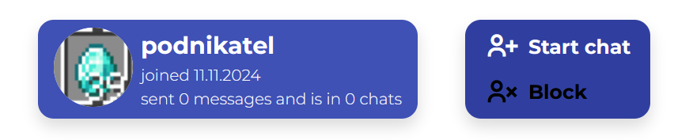
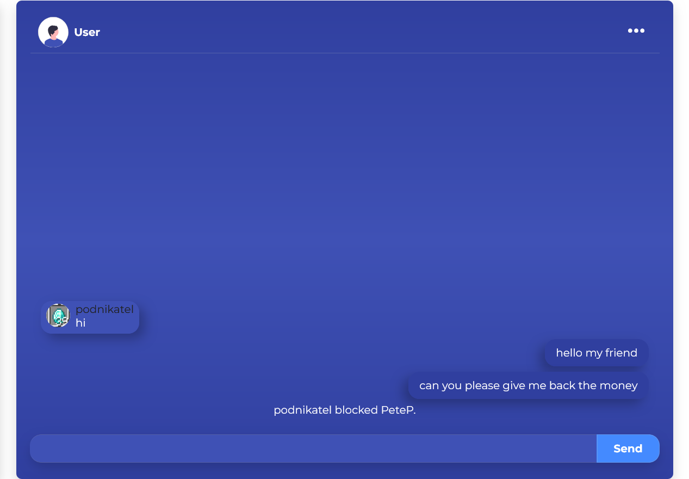
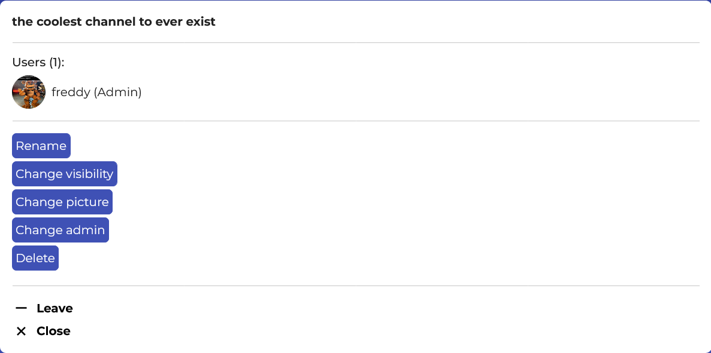
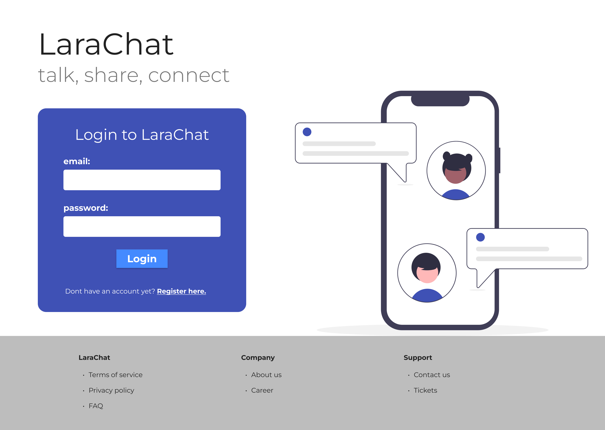
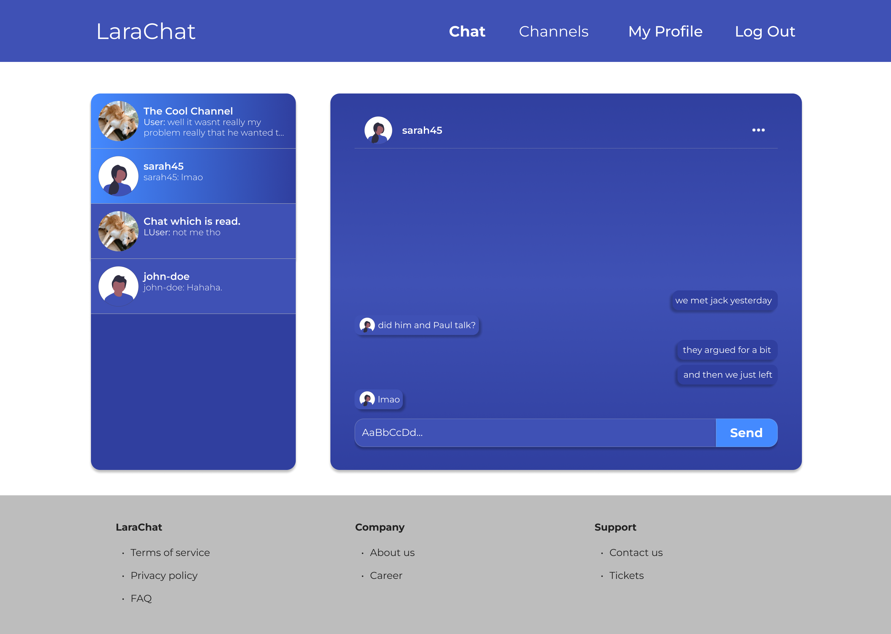

# Larachat - Laravel Chat

A Laravel real time chat app made with [Laravel 11](https://laravel.com/), [VueJS](https://vuejs.org/), [Bootstrap 5](https://getbootstrap.com/) and [Laravel Reverb](https://reverb.laravel.com/).

## Table of contents

-   [Too long, didn't read](#tldr)
-   [The logic of Larachat](#the-logic-of-larachat-and-my-thinking-behind-it)
    -   [Chats](#chats)
        -   [DM vs Channel](#dm-vs-channel)
        -   [How I did it](#how-i-did-it)
    -   [Blocking](#blocking)
        -   [UserChat](#userchat)
        -   [Showcase](#blocking-in-action)
    -   [Messages](#messages)
    -   [Channel admin](#channel-admin)
    -   [The real time experience](#the-real-time-experience)
-   [The long story](#the-long-story)
    -   [TickTick](#ticktick-saved-me)
    -   [Livewire](#i-tried-livewire)
    -   [VueJS](#vuejs)
    -   [Last words and thoughts](#finish)

> # TL;DR
>
> -   Laravel has so much in it and I think I still haven't seen the best of it.
> -   This project took 4 months to complete with occasional breaks.
> -   For the first time I used Figma, it was painful.
> -   I enjoy using Vue.
> -   I have love & hate relationship with Bootstrap.
> -   Laravel Reverb is conveniently easy to use & I like it.
> -   I love Laravel.
> -   The app [TickTick](https://ticktick.com/) helped me working on this project & also finishing it. (And it still helps me a ton to organise my daily tasks)
>
> This project could have included more features, but I brought it to a state that exceeded what the original idea & plan was.

# The logic of Larachat (and my thinking behind it)

I would like to explain my thinking behind the structure and code of this project. The problem is that I am writing this at the end after I finished this project and in some cases I don't remember why I did some stuff and what was my reasoning at the time.

## Chats

### DM vs Channel

DM (Direct Message) is just for 2 people to chat privately, like in many other chatting apps. You can start a chat with someone by clicking on **Start chat** on their profile page. Then, if the user trying to start the chat is not blocked by the other user a new chat is created between these two, until one of them decides to block the other one.

A channel can be either public or private. Public channel is listed in "/channels" and any user can join it at any time, while a private channel is not shown in the channels list and no user can join it.

## How I did it

I wanted to be really cool and a smart-ass, so I thought that I would have only 1 table for chats (instead of having one for dms and other for channels). The problem was that I wanted to have both DMs and channels which were distinguishably different from each other. What started as a smart, universal, clean plan turned into many refactors, changes in database structure and several moments of giving up.

> ### Original chats table
>
> string _name_  
> boolean _is_private_

The boolean _is_private_ was supposed to be the way of discriminating between a DM and a channel, what I forgot was that I wanted to also have private channels...

> ### Current chats table
>
> string _name_  
> enum _type_  
> string _picture_  
> boolean _is_private_  
> timestamp _last_message_

Fast forward to the present and each chat now has a _type_ field, which is an enum with two types dm & channel. My old self would cringe at this because the table contains direct _type_ field instead of pulling the type of the chat out of other field. (In hindsight I was just being dumb and I just don't know why I didn't want to have a field which would just specify the type of the chat, I guess I was too young to have such knowledge.)

Just to mention it, I wanted channels to have a chat picture because a DM's chat picture is always the user's profile picture you are chatting with, this couldn't be done for channels of course, so for a DM the value of this field is "other user", I am still not sure if this was the right thing to do, but I didn't want to have a null value for this field.

## Blocking

It wouldn't be a chatting app, if you couldn't block someone when you lost in an argument. So of course I wanted to add this to my app.

UserBlock model contains only 2 user ids: _user_id_ (the one who is blocking) and _blocked_user_id_. This is how the migration looks like for these two fields:

    $table->foreignIdFor(User::class, "user_id")->constrained()->onDelete("cascade");
    $table->foreignIdFor(User::class, "blocked_user_id")->constrained("users")->onDelete("cascade");

_Did you know not having constrained() makes onDelete not work? Yeah I learned the hard way :D_

Now I when a user blocks another user, we need to hide this chat for him, but let's keep it for the other user, so he can screenshot it and show everyone that he was blocked, right? Here comes the need for UserChat model.

### UserChat

A **pivot** model in order to achieve showing a chat only to one user while keeping the chat in chats table. This model also allows for functions such as checking, if the chat is read/unread based on _last_read_ field (a timestamp of the last time the user read this chat).

### Blocking in action

This image shows the best usage of a block in a chat app.

For some reason during working on the project I made the user who was blocked unable to see the name and the profile picture of the other user, I think it looks cool.

The creation of the sole block in database is easy, what was hard was the way of how to get the chat in which this happened because only through the chat could I access the UserChat to delete it for the one user.

    // Find the Chat of these 2 users (eloquent magic)
    $chat = Chat::whereType("dm")
        // Check for the blocking user
        ->whereHas("userChats", function ($query) use ($userId) {
            $query->where("user_id", $userId);
        })
        ->whereHas("userChats", function ($query) use ($blockedUserId) {
            $query->where("user_id", $blockedUserId);
        })->first();

In the comment I called it the eloquent magic as I was working for the first time with _whereHas_ function and it was quite frustrating to make it do what I wanted, it turned out to be easy, and I was just 'over-engineering' it as always.

At the end the only thing to do was to find the UserChat with the _user_id_ of the user and delete it :)  
Check the whole [UserBlockController](./app/Http/Controllers/UserBlockController.php).

Of course at any time you can unblock a user and the UserChat is once again created for you, showing you the chat.

## Messages

A message has simple structure: the id of the user who sent it and the content of the message. This would be enough, but later in the project I decided to add _type_ enum field to each message. Message can either be a user message or a (system) notification message.

This was added to send notification messages in chats for actions like joining, leaving, blocking, kicking, etc.

    <!-- Notification -->
    

        {{ message.content }}
    

This way in Vue I can just easily check the message type. Then there is another check, if the message was sent by the user or if it was received, based on this either a ChatSentMessage or ChatReceivedMessage component is rendered in the ChatContainer.

## Channel admin

When you create a channel, you automatically become its admin. An admin has permission to rename the channel, change its visibility (public/private), its chat picture, change the admin of the channel (make other user admin) and finally delete the channel.

All these actions are real time thanks to Laravel and dynamic thanks to Vue.

## The real time experience

The way the user receives real time updates is thanks to Laravel Reverb. First few hours were rough as there wasn't that much information about how to setup Reverb for my liking, but after a while I managed to do it and I was happy with the result. For each Reverb event you need to create an event class with artisan command:

    php artisan make:event

For example a ChatUpdated event class looks like this:

    class ChatUpdated implements ShouldBroadcastNow
    {
        use Dispatchable, InteractsWithSockets, SerializesModels;

        public readonly int $chatId;
        public readonly array $data;

        /**
        * Create a new event instance.
        */
        public function __construct(
            int $chatId,
            array $data
        ) {
            $this->chatId = $chatId;
            $this->data = $data;
        }

        /**
        * Get the channels the event should broadcast on.
        *
        * @return array<int, \Illuminate\Broadcasting\Channel>
        */
        public function broadcastOn(): array
        {
            return [
                new PrivateChannel("chats." . $this->chatId),
            ];
        }
    }

To make the event be instantly broadcast, the class needs to implement **ShouldBroadcastNow**. Because I wanted each chat to have a private channel, so only users in it can listen to it, I use the PrivateChannel and simple naming convention of "chats.chatId". Then in class _channels.php_ I set this check:

    Broadcast::channel("chats.{chatId}", function (User $user, int $chatId) {
        return UserChat::where("user_id", $user->id)->where("chat_id", $chatId)->exists();
    });

I simply check, if the user has a UserChat for this chat.  
Then broadcasting this event is simple with one function:

    event(new ChatUpdated($chat->id, $data));

As last step, in Vue component I listen to the events in chat channels in which the user is using Laravel Echo.

This way I have many events including:

-   MessageSent - when a user sends a message (or a notification is sent) in a chat, this event is broadcasted
-   ChatUpdated - when channel admin updates a channel, the change is real time
-   ChatAdminChanged - this is a separate event as ChatAdmin is a model on its own
-   UserChatDeleted - one of the cooler events, which purpose is to remove a chat from user's interface, if for instance he was kicked/banned or he left it, this is really cool because before there was full page reset instead of dynamic change
-   UserBannedFromChat - this had to be an event just because the chat admin has a banned users list which I wanted to be dynamically updated in real time because what, if he wants to unban the user the second after he banned him? in that case we need for the banned users list to be updated instantly, so an event was needed for this
-   UserJoinedChat
-   UserLeftChat

# The long story

When I started this project I had no experience with Bootstrap or Laravel Reverb. The reason for choosing Reverb was because it was just released and I was excited to use it as it seemed easy to implement. I chose Bootstrap for this project to give it a chance, as I had only used TailwindCSS before.

I wasn't planning on using VueJS in this project because for some reason I thought that I would be able to "just do it with vanilla JS".

I started working on this project **(27.7.2024)** after I wrote this simple plan: laravel chat app with DMs & channels, where users can block each other. Because of such a simple plan I thought that I could finish it in a month and finish it just before my school starts in september.

The work started in Figma, after I learned the basics, I was able to design the homepage and chat page.  

Then after losing my mind a little bit I started working on the base database tables, models, controllers and the homepage view. To avoid getting stuck on one aspect of the project, like design, I worked on multiple tasks simultaneously (not literally). Like in one day I would try to get an idea of how the chat page could look, while also implementing Laravel Reverb into the project.

### TickTick saved me

Before this project, I had many abandoned projects, which even with the initial motivation weren't sadly finished. I didn't want this trend to continue, so I installed TickTick on my phone, to add tasks for the next day for Larachat. The tasks were ranging from "design homepage" to "user register".

Sometimes, I got frustrated with myself for not writing more tasks which are simple than writing few tasks which contain 10 subproblems.  
I know and I knew that is the right way to do it, but I am too lazy to write out all the simple tasks in between, I would rather just straight up go do it than waste time writing what I am supposed to do.

### I tried Livewire

And I didn't enjoy it. **Mainly** for the sole reason that it was _slow_. "When running a project on my PC locally, shouldn't it be _fast_?" I asked myself. For some reason after playing with Livewire for few days sending a message was slow and I didn't bother trying to fix it, so I am not saying that Livewire is bad, but it just didn't work for me and I just migrated to Vue.

> Just to be clear, sending a message with Livewire took seconds, while with Vue its instant.

### VueJS

I had small problems with installing Vue into this project the way I wanted it, but it worked out pretty well I think. I think I like Vue so much just because I didn't actually try any other JS framework. On the other hand I chose Vue after looking at the structure of other frameworks and Vue seemed most intuitive.

I love how reactivity works in Vue and I am really happy it is so easy to do so much. I hate DOM manipulation and I am happy not to do it. Also using watch() is so cool.

What is maybe sad is that I didn't try any state managment ([Pinia](https://pinia.vuejs.org/)), but I didn't have many reasons to add it, but maybe I should have and I don't know about it.

## Finish

I am happy that I managed to get an idea turned into a somewhat finished project. I know there is still a place for more features and more refining, optimizing, but I am content with how far this project has come.

I think I reinfornced my knowledge of Laravel (and PHP in general), Vue, MySQL and all other technology & tools thanks to working on this project. Right now I am in a weird state where I know that I don't know that much, but I don't want to undermine my current knowledge at the same time.

What lies ahead of me is a mystery, maybe I will get back to this project one day out of pure boredom, more probably it will be forgotten and never touched again, becoming obsolete in maybe 2 years with new Laravel, Vue or Reverb updates.
